# 🏗️ REFACTORIZACIÓN ARQUITECTÓNICA - ERP Sistema de Ventas

## 📋 Índice

1. [Regla Arquitectónica](#regla-arquitectónica)
2. [Estructura de Servicios de Dominio](#estructura-de-servicios-de-dominio)
3. [Modelo de Datos - Cheques](#modelo-de-datos---cheques)
4. [Endpoints API Unificados](#endpoints-api-unificados)
5. [Flujos de Negocio](#flujos-de-negocio)
6. [Plan de Implementación](#plan-de-implementación)
7. [Tests](#tests)

---

## 🎯 Regla Arquitectónica

### Backend (Laravel) - ÚNICA FUENTE DE VERDAD
**TODO lo que cambie dinero, stock o estados contables debe ir en el BACKEND:**

✅ Validar límites de crédito  
✅ Actualizar saldo de cuenta corriente  
✅ Marcar ventas como impaga/parcial/pagada  
✅ Aplicar pagos FIFO sobre deudas  
✅ Registrar movimientos de stock  
✅ Registrar cheques, su estado y su impacto en CC/caja

### Frontend (Vue 3) - SOLO PRESENTACIÓN Y UX

✅ Mostrar datos ya calculados por el backend  
✅ Enviar datos "crudos" de formularios  
✅ Hacer validaciones de UX (required, formato)  
✅ Mostrar errores devueltos por la API  
✅ Cálculos visuales de previsualización (sin impacto en BD)

### Principio de Independencia
**Si mañana alguien usa Postman/cURL/app móvil contra la API, el sistema debe seguir siendo consistente sin el frontend.**

---

## 🏛️ Estructura de Servicios de Dominio

```
app/
  Services/
    Ventas/
      RegistrarVentaService.php  ← Creación de ventas + validación de crédito
      RegistrarPagoVentaService.php  ← Pagos de ventas específicas
    Finanzas/
      CuentaCorrienteService.php  ← Gestión de CC (deudas, pagos FIFO)
      ChequeService.php  ← Ciclo de vida de cheques
    Stock/
      MovimientoStockService.php  ← (Opcional) Gestión de inventario
```

---

## 📊 Modelo de Datos - Cheques

### Migración: `create_cheques_table.php`

```php
<?php
use Illuminate\Database\Migrations\Migration;
use Illuminate\Database\Schema\Blueprint;
use Illuminate\Support\Facades\Schema;

return new class extends Migration
{
    public function up(): void
    {
        Schema::create('cheques', function (Blueprint $table) {
            $table->id();
            
            // Relaciones
            $table->foreignId('venta_id')->constrained('ventas')->onDelete('cascade');
            $table->foreignId('cliente_id')->constrained('clientes');
            $table->foreignId('pago_id')->nullable()->constrained('pagos')->onDelete('set null');
            
            // Datos del cheque
            $table->string('numero')->nullable()->comment('Número de cheque');
            $table->decimal('monto', 15, 2);
            $table->date('fecha_emision')->nullable();
            $table->date('fecha_vencimiento')->nullable();
            
            // Estado y seguimiento
            $table->enum('estado', ['pendiente', 'cobrado', 'rechazado'])->default('pendiente');
            $table->date('fecha_cobro')->nullable();
            $table->date('fecha_rechazo')->nullable();
            $table->text('motivo_rechazo')->nullable();
            $table->text('observaciones')->nullable();
            
            $table->timestamps();
            
            // Índices
            $table->index(['cliente_id', 'estado']);
            $table->index(['venta_id']);
            $table->index(['fecha_vencimiento']);
            $table->index(['estado', 'fecha_vencimiento']);
        });
    }

    public function down(): void
    {
        Schema::dropIfExists('cheques');
    }
};
```

### Modelo: `app/Models/Cheque.php`

```php
<?php
namespace App\Models;

use Illuminate\Database\Eloquent\Model;
use Illuminate\Database\Eloquent\Factories\HasFactory;

class Cheque extends Model
{
    use HasFactory;

    protected $fillable = [
        'venta_id',
        'cliente_id',
        'pago_id',
        'numero',
        'monto',
        'fecha_emision',
        'fecha_vencimiento',
        'estado',
        'fecha_cobro',
        'fecha_rechazo',
        'motivo_rechazo',
        'observaciones',
    ];

    protected $casts = [
        'fecha_emision' => 'date',
        'fecha_vencimiento' => 'date',
        'fecha_cobro' => 'date',
        'fecha_rechazo' => 'date',
        'monto' => 'decimal:2',
    ];

    // Relaciones
    public function venta()
    {
        return $this->belongsTo(Venta::class);
    }

    public function cliente()
    {
        return $this->belongsTo(Cliente::class);
    }

    public function pago()
    {
        return $this->belongsTo(Pago::class);
    }

    // Scopes
    public function scopePendientes($query)
    {
        return $query->where('estado', 'pendiente');
    }

    public function scopeCobrados($query)
    {
        return $query->where('estado', 'cobrado');
    }

    public function scopeRechazados($query)
    {
        return $query->where('estado', 'rechazado');
    }

    public function scopeVencidos($query)
    {
        return $query->where('estado', 'pendiente')
                    ->whereNotNull('fecha_vencimiento')
                    ->whereDate('fecha_vencimiento', '<', now());
    }

    public function scopeProximosAVencer($query, int $dias = 7)
    {
        return $query->where('estado', 'pendiente')
                    ->whereNotNull('fecha_vencimiento')
                    ->whereBetween('fecha_vencimiento', [
                        now(),
                        now()->addDays($dias)
                    ]);
    }
}
```

---

## 🌐 Endpoints API Unificados

### 1. Ventas

```php
// routes/api.php
Route::prefix('v1')->group(function () {
    
    // Crear venta
    POST /api/v1/ventas
    {
        "cliente_id": 1,
        "fecha": "2025-12-01",
        "tipo_comprobante": "FC-A",
        "items": [
            {
                "producto_id": 10,
                "cantidad": 2,
                "precio_unitario": 1000,
                "iva": 21
            }
        ],
        "pagos": [
            {
                "metodo_pago_id": 1, // Efectivo
                "monto": 500
            },
            {
                "metodo_pago_id": 3, // Cheque
                "monto": 1000,
                "numero_cheque": "12345678",
                "fecha_cheque": "2025-12-01",
                "fecha_vencimiento": "2025-12-30"
            }
        ]
    }
    
    // Si hay saldo pendiente y el cliente tiene CC, automáticamente se asigna a CC
});
```

### 2. Pagos de Venta (Unificado)

```php
// ÚNICO endpoint para registrar pagos de una venta
POST /api/v1/ventas/{venta}/pagos
{
    "metodo_pago_id": 1,
    "monto": 500,
    "fecha_pago": "2025-12-02",
    // Campos opcionales para cheques
    "numero_cheque": "87654321",
    "fecha_vencimiento": "2025-12-15"
}

// El servicio se encarga de:
// 1. Validar que no exceda saldo pendiente
// 2. Si es cheque, crear registro en tabla cheques
// 3. Aplicar pago a CC si corresponde
// 4. Actualizar estado_pago de la venta
// 5. Recalcular saldo del cliente
```

### 3. Pagos de Cuenta Corriente (Genéricos)

```php
// Para pagos sin venta específica (cliente paga saldo general)
POST /api/v1/clientes/{cliente}/cuenta-corriente/pagos
{
    "metodo_pago_id": 1,
    "monto": 5000,
    "fecha_pago": "2025-12-02",
    "observaciones": "Pago adelantado"
}

// El servicio:
// 1. Aplica FIFO a ventas más antiguas
// 2. Actualiza estados de ventas afectadas
// 3. Recalcula saldo del cliente
```

### 4. Seguimiento de Cheques

```php
// Listar cheques pendientes con alertas
GET /api/v1/cheques?estado=pendiente&dias_alerta=7

// Respuesta
{
    "cheques": [
        {
            "id": 1,
            "numero": "12345678",
            "monto": 1500.00,
            "estado": "pendiente",
            "fecha_vencimiento": "2025-12-15",
            "dias_restantes": 14,
            "vencido": false,
            "proximo_a_vencer": false,
            "venta": {
                "id": 10,
                "numero": 10
            },
            "cliente": {
                "id": 5,
                "nombre": "Juan Pérez"
            }
        }
    ],
    "resumen": {
        "total": 10,
        "vencidos": 2,
        "proximos_a_vencer": 3,
        "sin_fecha": 1,
        "monto_total": 15000.00
    }
}

// Cobrar cheque
POST /api/v1/cheques/{cheque}/cobrar
{
    "fecha_cobro": "2025-12-10"
}

// Rechazar cheque
POST /api/v1/cheques/{cheque}/rechazar
{
    "motivo_rechazo": "Fondos insuficientes"
}

// Historial de cheques
GET /api/v1/cheques/historial?estado=cobrado
```

---

## 🔄 Flujos de Negocio

### Flujo 1: Venta con Parte Contado + Parte CC

```mermaid
graph TD
    A[Frontend: Crear Venta] --> B[POST /api/v1/ventas]
    B --> C{VentaService}
    C --> D[Calcular Total desde Items]
    C --> E[Calcular Total Pagos Reales]
    C --> F{Saldo Pendiente > 0?}
    F -->|Sí| G{Cliente tiene CC?}
    G -->|Sí| H[Validar Límite Crédito]
    G -->|No| I[ERROR: Debe pagar total]
    H --> J{Excede Límite?}
    J -->|Sí| K[ERROR 422]
    J -->|No| L[Crear Venta]
    L --> M[Crear Items]
    L --> N[Procesar Pagos Reales]
    N --> O{¿Pago es Cheque?}
    O -->|Sí| P[ChequeService::registrar]
    O -->|No| Q[Crear Pago Normal]
    L --> R[Calcular Saldo Pendiente]
    R --> S{Saldo Pendiente > 0?}
    S -->|Sí| T[CuentaCorrienteService::registrarDeuda]
    T --> U[Actualizar Saldo Cliente]
    S -->|No| V[Estado: Pagado]
    U --> W[Determinar Estado Venta]
```



### Flujo 2: Pago Parcial de Venta

```mermaid
graph TD
    A[POST /api/v1/ventas/{venta}/pagos] --> B{RegistrarPagoVentaService}
    B --> C[Calcular Deuda Actual Venta]
    C --> D{Monto > Deuda?}
    D -->|Sí| E[ERROR 422]
    D -->|No| F[Crear Pago]
    F --> G{¿Es Cheque?}
    G -->|Sí| H[ChequeService::registrar]
    G -->|No| I[Continuar]
    H --> J{¿Afecta CC?}
    J -->|Sí| K[CuentaCorrienteService::aplicarPago]
    J -->|No| L[Solo registrar Pago]
    K --> M[Recalcular Estado Venta]
    L --> M
    M --> N{Deuda = 0?}
    N -->|Sí| O[Estado: Pagado]
    N -->|No| P[Estado: Parcial]
```

### Flujo 3: Cobro de Cheque

```mermaid
graph TD
    A[POST /api/v1/cheques/{cheque}/cobrar] --> B{ChequeService}
    B --> C{Estado = Pendiente?}
    C -->|No| D[ERROR: Ya procesado]
    C -->|Sí| E[Marcar como Cobrado]
    E --> F[CuentaCorrienteService::registrarPagoPorCheque]
    F --> G[Crear Movimiento HABER]
    G --> H[Recalcular Saldo Cliente]
    H --> I[Actualizar Estado Venta]
    I --> J{Venta totalmente pagada?}
    J -->|Sí| K[Estado Venta: Pagado]
    J -->|No| L[Estado Venta: Parcial]
```

---

## 📝 Servicios de Dominio - Detalles de Implementación

### A) `App\Services\Ventas\RegistrarVentaService`

```php
<?php
namespace App\Services\Ventas;

use App\Models\Venta;
use App\Models\DetalleVenta;
use App\Models\Cliente;
use App\Models\Pago;
use App\Models\MetodoPago;
use App\Services\Finanzas\CuentaCorrienteService;
use App\Services\Finanzas\ChequeService;
use Illuminate\Support\Facades\DB;
use Illuminate\Validation\ValidationException;

/**
 * INVARIANTES GARANTIZADOS:
 * - El total se calcula SIEMPRE desde items (nunca confiar en frontend)
 * - Si el cliente no tiene CC, debe pagar el 100% al contado
 * - Si tiene CC, se valida límite de crédito ANTES de crear
 * - Los pagos con cheque crean automáticamente registro en tabla cheques
 * - El estado_pago se calcula automáticamente
 */
class RegistrarVentaService
{
    protected $cuentaCorrienteService;
    protected $chequeService;

    public function __construct(
        CuentaCorrienteService $cuentaCorrienteService,
        ChequeService $chequeService
    ) {
        $this->cuentaCorrienteService = $cuentaCorrienteService;
        $this->chequeService = $chequeService;
    }

    public function ejecutar(Cliente $cliente, array $data): Venta
    {
        return DB::transaction(function () use ($cliente, $data) {
            
            // 1. Bloquear cliente
            $cliente = Cliente::lockForUpdate()->findOrFail($cliente->id);

            // 2. Calcular total desde items
            $total = $this->calcularTotalDesdeItems($data['items']);
            
            // 3. Calcular total de pagos reales (excluyendo CC)
            $totalPagos = $this->calcularTotalPagosReales($data['pagos'] ?? []);
            
            // 4. Calcular saldo pendiente
            $saldoPendiente = round($total - $totalPagos, 2);
            
            // 5. Validar límite de crédito si hay saldo pendiente
            if ($saldoPendiente > 0.01) {
                $this->validarLimiteCredito($cliente, $saldoPendiente);
            }
            
            // 6. Crear venta
            $venta = $this->crearVenta($cliente, $data, $total);
            
            // 7. Crear items
            $this->crearItems($venta, $data['items']);
            
            // 8. Procesar pagos reales
            $this->procesarPagos($venta, $data['pagos'] ?? []);
            
            // 9. Registrar deuda en CC si hay saldo pendiente
            if ($saldoPendiente > 0.01) {
                $this->cuentaCorrienteService->registrarDeudaPorVenta($venta, $saldoPendiente);
            }
            
            // 10. Determinar estado final
            $venta->estado_pago = $this->determinarEstadoPago($venta);
            $venta->save();
            
            return $venta->fresh(['items', 'pagos', 'cliente']);
        });
    }

    protected function calcularTotalDesdeItems(array $items): float
    {
        $total = 0;
        foreach ($items as $item) {
            $cantidad = (float)$item['cantidad'];
            $precio = (float)$item['precio_unitario'];
            $iva = (float)($item['iva'] ?? 0);
            $subtotal = $cantidad * $precio * (1 + $iva / 100);
            $total += $subtotal;
        }
        return round($total, 2);
    }

    protected function calcularTotalPagosReales(array $pagos): float
    {
        $total = 0;
        foreach ($pagos as $pago) {
            $metodoPago = MetodoPago::find($pago['metodo_pago_id']);
            // Excluir Cuenta Corriente
            if ($metodoPago && strtolower($metodoPago->nombre) !== 'cuenta corriente') {
                $total += (float)$pago['monto'];
            }
        }
        return round($total, 2);
    }

    protected function validarLimiteCredito(Cliente $cliente, float $saldoPendiente): void
    {
        if ((float)$cliente->limite_credito <= 0) {
            throw ValidationException::withMessages([
                'pago' => 'El cliente no tiene cuenta corriente. Debe pagar el total de la venta.'
            ]);
        }

        $saldoActual = $cliente->calcularSaldoReal();
        $saldoProyectado = $saldoActual + $saldoPendiente;

        if ($saldoProyectado > (float)$cliente->limite_credito + 0.01) {
            throw ValidationException::withMessages([
                'limite_credito' => sprintf(
                    'Excedería el límite de crédito. Límite: $%s, Deuda actual: $%s, Disponible: $%s',
                    number_format($cliente->limite_credito, 2),
                    number_format($saldoActual, 2),
                    number_format($cliente->limite_credito - $saldoActual, 2)
                )
            ]);
        }
    }

    protected function crearVenta(Cliente $cliente, array $data, float $total): Venta
    {
        return Venta::create([
            'cliente_id' => $cliente->id,
            'usuario_id' => auth()->id(),
            'fecha' => $data['fecha'] ?? now(),
            'tipo_comprobante' => $data['tipo_comprobante'] ?? null,
            'numero_comprobante' => $data['numero_comprobante'] ?? null,
            'total' => $total,
            'estado_pago' => 'pendiente', // Se actualizará al final
        ]);
    }

    protected function crearItems(Venta $venta, array $items): void
    {
        foreach ($items as $item) {
            DetalleVenta::create([
                'venta_id' => $venta->id,
                'producto_id' => $item['producto_id'],
                'cantidad' => $item['cantidad'],
                'precio_unitario' => $item['precio_unitario'],
                'iva' => $item['iva'] ?? 0,
            ]);
        }
    }

    protected function procesarPagos(Venta $venta, array $pagos): void
    {
        foreach ($pagos as $pagoData) {
            $metodoPago = MetodoPago::find($pagoData['metodo_pago_id']);
            
            // Ignorar si es Cuenta Corriente (se maneja separado)
            if ($metodoPago && strtolower($metodoPago->nombre) === 'cuenta corriente') {
                continue;
            }

            // Crear pago
            $pago = Pago::create([
                'venta_id' => $venta->id,
                'metodo_pago_id' => $pagoData['metodo_pago_id'],
                'monto' => $pagoData['monto'],
                'fecha_pago' => $pagoData['fecha_pago'] ?? now(),
            ]);

            // Si es cheque, registrar en tabla cheques
            if ($metodoPago && strtolower($metodoPago->nombre) === 'cheque') {
                $this->chequeService->registrarChequeDesdeVenta($venta, [
                    'pago_id' => $pago->id,
                    'monto' => $pagoData['monto'],
                    'numero_cheque' => $pagoData['numero_cheque'] ?? null,
                    'fecha_cheque' => $pagoData['fecha_cheque'] ?? null,
                    'fecha_vencimiento' => $pagoData['fecha_vencimiento'] ?? null,
                    'observaciones' => $pagoData['observaciones_cheque'] ?? null,
                ]);
            }
        }
    }

    protected function determinarEstadoPago(Venta $venta): string
    {
        $venta->load('pagos');
        
        $total = (float)$venta->total;
        $totalPagado = (float)$venta->pagos
            ->where('metodo_pago_id', '!=', $this->getCuentaCorrienteId())
            ->sum('monto');

        if ($totalPagado >= $total - 0.01) {
            return 'pagado';
        } elseif ($totalPagado > 0.01) {
            return 'parcial';
        } else {
            return 'pendiente';
        }
    }

    protected function getCuentaCorrienteId()
    {
        return MetodoPago::where('nombre', 'Cuenta Corriente')->value('id');
    }
}
```

### B) `App\Services\Ventas\RegistrarPagoVentaService`

```php
<?php
namespace App\Services\Ventas;

use App\Models\Venta;
use App\Models\Pago;
use App\Models\MetodoPago;
use App\Services\Finanzas\CuentaCorrienteService;
use App\Services\Finanzas\ChequeService;
use Illuminate\Support\Facades\DB;
use Illuminate\Validation\ValidationException;

/**
 * INVARIANTES GARANTIZADOS:
 * - Nunca se puede pagar más de la deuda actual
 * - Los pagos se aplican correctamente a CC si corresponde
 * - El estado_pago de la venta se actualiza automáticamente
 * - Los cheques quedan pendientes hasta su cobro efectivo
 */
class RegistrarPagoVentaService
{
    protected $cuentaCorrienteService;
    protected $chequeService;

    public function __construct(
        CuentaCorrienteService $cuentaCorrienteService,
        ChequeService $chequeService
    ) {
        $this->cuentaCorrienteService = $cuentaCorrienteService;
        $this->chequeService = $chequeService;
    }

    public function ejecutar(Venta $venta, array $data): Pago
    {
        return DB::transaction(function () use ($venta, $data) {
            
            // 1. Calcular deuda actual de la venta
            $deudaActual = $this->calcularDeudaActual($venta);
            
            $monto = round((float)$data['monto'], 2);
            
            // 2. VALIDACIÓN: No pagar más de la deuda
            if ($monto > $deudaActual + 0.01) {
                throw ValidationException::withMessages([
                    'monto' => sprintf(
                        'El monto ($%s) excede la deuda actual ($%s)',
                        number_format($monto, 2),
                        number_format($deudaActual, 2)
                    )
                ]);
            }
            
            // 3. Crear pago
            $pago = Pago::create([
                'venta_id' => $venta->id,
                'metodo_pago_id' => $data['metodo_pago_id'],
                'monto' => $monto,
                'fecha_pago' => $data['fecha_pago'] ?? now(),
            ]);
            
            $metodoPago = MetodoPago::find($data['metodo_pago_id']);
            
            // 4. Si es cheque, registrar
            if ($metodoPago && strtolower($metodoPago->nombre) === 'cheque') {
                $this->chequeService->registrarChequeDesdeVenta($venta, [
                    'pago_id' => $pago->id,
                    'monto' => $monto,
                    'numero_cheque' => $data['numero_cheque'] ?? null,
                    'fecha_cheque' => $data['fecha_cheque'] ?? null,
                    'fecha_vencimiento' => $data['fecha_vencimiento'] ?? null,
                    'observaciones' => $data['observaciones_cheque'] ?? null,
                ]);
            }
            
            // 5. Aplicar pago a cuenta corriente si corresponde
            if ($this->debeAplicarseACC($venta)) {
                $this->cuentaCorrienteService->registrarPagoPorCheque(
                    clienteId: $venta->cliente_id,
                    ventaId: $venta->id,
                    monto: $monto,
                    fecha: $pago->fecha_pago,
                    observaciones: "Pago Venta #{$venta->id}"
                );
            }
            
            // 6. Actualizar estado de la venta
            $venta->refresh();
            $venta->estado_pago = $this->determinarEstadoPago($venta);
            $venta->save();
            
            return $pago->fresh();
        });
    }

    protected function calcularDeudaActual(Venta $venta): float
    {
        $total = (float)$venta->total;
        $totalPagado = (float)$venta->pagos
            ->where('metodo_pago_id', '!=', $this->getCuentaCorrienteId())
            ->sum('monto');
        
        return max(0, round($total - $totalPagado, 2));
    }

    protected function debeAplicarseACC(Venta $venta): bool
    {
        // Verificar si hay deuda en CC para esta venta
        return \App\Models\MovimientoCuentaCorriente::where('venta_id', $venta->id)
            ->where('tipo', 'venta')
            ->exists();
    }

    protected function determinarEstadoPago(Venta $venta): string
    {
        $deuda = $this->calcularDeudaActual($venta);
        
        if ($deuda <= 0.01) {
            return 'pagado';
        } elseif ($venta->pagos->count() > 0) {
            return 'parcial';
        } else {
            return 'pendiente';
        }
    }

    protected function getCuentaCorrienteId()
    {
        return MetodoPago::where('nombre', 'Cuenta Corriente')->value('id');
    }
}
```

---

## 📡 Resources para APIs Consistentes

### `app/Http/Resources/ChequeResource.php`

```php
<?php
namespace App\Http\Resources;

use Illuminate\Http\Resources\Json\JsonResource;

class ChequeResource extends JsonResource
{
    public function toArray($request)
    {
        return [
            'id' => $this->id,
            'numero' => $this->numero,
            'monto' => (float)$this->monto,
            'estado' => $this->estado,
            'fecha_emision' => $this->fecha_emision?->format('Y-m-d'),
            'fecha_vencimiento' => $this->fecha_vencimiento?->format('Y-m-d'),
            'fecha_cobro' => $this->fecha_cobro?->format('Y-m-d'),
            'fecha_rechazo' => $this->fecha_rechazo?->format('Y-m-d'),
            'motivo_rechazo' => $this->motivo_rechazo,
            'observaciones' => $this->observaciones,
            
            // Datos calculados (si están disponibles)
            'dias_restantes' => $this->when(isset($this->dias_restantes), $this->dias_restantes),
            'vencido' => $this->when(isset($this->vencido), $this->vencido),
            'proximo_a_vencer' => $this->when(isset($this->proximo_a_vencer), $this->proximo_a_vencer),
            
            // Relaciones
            'venta' => [
                'id' => $this->venta?->id,
                'numero' => $this->venta?->numero_comprobante ?? $this->venta?->id,
                'total' => (float)($this->venta?->total ?? 0),
            ],
            
            'cliente' => [
                'id' => $this->cliente?->id,
                'nombre' => $this->cliente?->nombre_completo ?? $this->cliente?->nombre,
            ],
            
            'created_at' => $this->created_at?->toISOString(),
            'updated_at' => $this->updated_at?->toISOString(),
        ];
    }
}
```

---

## 🧪 Tests de Feature

### `tests/Feature/VentaCuentaCorrienteTest.php`

```php
<?php
namespace Tests\Feature;

use Tests\TestCase;
use App\Models\Cliente;
use App\Models\Producto;
use App\Models\MetodoPago;
use App\Models\Usuario;
use Illuminate\Foundation\Testing\RefreshDatabase;

class VentaCuentaCorrienteTest extends TestCase
{
    use RefreshDatabase;

    protected $usuario;
    protected $cliente;
    protected $producto;
    protected $metodoPago;

    protected function setUp(): void
    {
        parent::setUp();
        
        $this->usuario = Usuario::factory()->create();
        $this->cliente = Cliente::factory()->create([
            'limite_credito' => 10000,
        ]);
        $this->producto = Producto::factory()->create([
            'precio_venta' => 1000,
        ]);
        $this->metodoPago = MetodoPago::factory()->create([
            'nombre' => 'Efectivo'
        ]);
    }

    /** @test */
    public function puede_crear_venta_con_parte_contado_y_parte_cc()
    {
        $response = $this->actingAs($this->usuario, 'api')
            ->postJson('/api/v1/ventas', [
                'cliente_id' => $this->cliente->id,
                'items' => [
                    [
                        'producto_id' => $this->producto->id,
                        'cantidad' => 5,
                        'precio_unitario' => 1000,
                        'iva' => 0,
                    ]
                ],
                'pagos' => [
                    [
                        'metodo_pago_id' => $this->metodoPago->id,
                        'monto' => 2000,
                    ]
                ]
            ]);

        $response->assertStatus(201);
        
        $venta = $response->json();
        $this->assertEquals(5000, $venta['total']);
        $this->assertEquals('parcial', $venta['estado_pago']);
        
        // Verificar que se creó deuda en CC
        $this->cliente->refresh();
        $this->assertEquals(3000, $this->cliente->saldo_actual);
    }

    /** @test */
    public function no_puede_exceder_limite_de_credito()
    {
        $response = $this->actingAs($this->usuario, 'api')
            ->postJson('/api/v1/ventas', [
                'cliente_id' => $this->cliente->id,
                'items' => [
                    [
                        'producto_id' => $this->producto->id,
                        'cantidad' => 15, // 15000 total
                        'precio_unitario' => 1000,
                        'iva' => 0,
                    ]
                ],
                'pagos' => []
            ]);

        $response->assertStatus(422);
        $response->assertJsonValidationErrors('limite_credito');
    }

    /** @test */
    public function pago_parcial_actualiza_estado_correctamente()
    {
        // Crear venta con deuda
        $venta = $this->crearVentaConDeuda(5000, 2000);
        
        // Registrar pago parcial
        $response = $this->actingAs($this->usuario, 'api')
            ->postJson("/api/v1/ventas/{$venta->id}/pagos", [
                'metodo_pago_id' => $this->metodoPago->id,
                'monto' => 1000,
            ]);

        $response->assertStatus(201);
        
        $venta->refresh();
        $this->assertEquals('parcial', $venta->estado_pago);
        $this->assertEquals(2000, $this->cliente->fresh()->saldo_actual);
    }

    /** @test */
    public function pago_total_marca_venta_como_pagada()
    {
        $venta = $this->crearVentaConDeuda(5000, 2000);
        
        $response = $this->actingAs($this->usuario, 'api')
            ->postJson("/api/v1/ventas/{$venta->id}/pagos", [
                'metodo_pago_id' => $this->metodoPago->id,
                'monto' => 3000, // Paga el resto
            ]);

        $response->assertStatus(201);
        
        $venta->refresh();
        $this->assertEquals('pagado', $venta->estado_pago);
        $this->assertEquals(0, $this->cliente->fresh()->saldo_actual);
    }

    /** @test */
    public function no_puede_pagar_mas_de_la_deuda()
    {
        $venta = $this->crearVentaConDeuda(5000, 2000);
        
        $response = $this->actingAs($this->usuario, 'api')
            ->postJson("/api/v1/ventas/{$venta->id}/pagos", [
                'metodo_pago_id' => $this->metodoPago->id,
                'monto' => 5000, // Intenta pagar más de lo que debe (3000)
            ]);

        $response->assertStatus(422);
        $response->assertJsonValidationErrors('monto');
    }

    protected function crearVentaConDeuda($total, $pagado)
    {
        $response = $this->actingAs($this->usuario, 'api')
            ->postJson('/api/v1/ventas', [
                'cliente_id' => $this->cliente->id,
                'items' => [
                    [
                        'producto_id' => $this->producto->id,
                        'cantidad' => $total / 1000,
                        'precio_unitario' => 1000,
                        'iva' => 0,
                    ]
                ],
                'pagos' => [
                    [
                        'metodo_pago_id' => $this->metodoPago->id,
                        'monto' => $pagado,
                    ]
                ]
            ]);

        return \App\Models\Venta::find($response->json('id'));
    }
}
```

### `tests/Feature/ChequeTest.php`

```php
<?php
namespace Tests\Feature;

use Tests\TestCase;
use App\Models\Cliente;
use App\Models\Venta;
use App\Models\Cheque;
use App\Models\Usuario;
use Illuminate\Foundation\Testing\RefreshDatabase;

class ChequeTest extends TestCase
{
    use RefreshDatabase;

    /** @test */
    public function cheque_se_registra_correctamente_desde_venta()
    {
        $usuario = Usuario::factory()->create();
        $cliente = Cliente::factory()->create(['limite_credito' => 10000]);
        $metodoCheque = \App\Models\MetodoPago::factory()->create(['nombre' => 'Cheque']);
        
        $response = $this->actingAs($usuario, 'api')
            ->postJson('/api/v1/ventas', [
                'cliente_id' => $cliente->id,
                'items' => [
                    [
                        'producto_id' => \App\Models\Producto::factory()->create()->id,
                        'cantidad' => 1,
                        'precio_unitario' => 5000,
                        'iva' => 0,
                    ]
                ],
                'pagos' => [
                    [
                        'metodo_pago_id' => $metodoCheque->id,
                        'monto' => 5000,
                        'numero_cheque' => '12345678',
                        'fecha_vencimiento' => now()->addDays(30)->format('Y-m-d'),
                    ]
                ]
            ]);

        $response->assertStatus(201);
        
        $this->assertDatabaseHas('cheques', [
            'numero' => '12345678',
            'monto' => 5000,
            'estado' => 'pendiente',
        ]);
    }

    /** @test */
    public function cobrar_cheque_reduce_deuda_cliente()
    {
        $usuario = Usuario::factory()->create();
        $cliente = Cliente::factory()->create(['limite_credito' => 10000]);
        $venta = Venta::factory()->create(['cliente_id' => $cliente->id, 'total' => 5000]);
        $cheque = Cheque::factory()->create([
            'venta_id' => $venta->id,
            'cliente_id' => $cliente->id,
            'monto' => 5000,
            'estado' => 'pendiente',
        ]);
        
        // Cliente debe 5000
        $cliente->update(['saldo_actual' => 5000]);
        
        $response = $this->actingAs($usuario, 'api')
            ->postJson("/api/v1/cheques/{$cheque->id}/cobrar");

        $response->assertStatus(200);
        
        $cheque->refresh();
        $this->assertEquals('cobrado', $cheque->estado);
        
        $cliente->refresh();
        $this->assertEquals(0, $cliente->saldo_actual);
    }

    /** @test */
    public function rechazar_cheque_mantiene_deuda()
    {
        $usuario = Usuario::factory()->create();
        $cliente = Cliente::factory()->create(['limite_credito' => 10000, 'saldo_actual' => 5000]);
        $venta = Venta::factory()->create(['cliente_id' => $cliente->id]);
        $cheque = Cheque::factory()->create([
            'venta_id' => $venta->id,
            'cliente_id' => $cliente->id,
            'monto' => 5000,
            'estado' => 'pendiente',
        ]);
        
        $response = $this->actingAs($usuario, 'api')
            ->postJson("/api/v1/cheques/{$cheque->id}/rechazar", [
                'motivo_rechazo' => 'Fondos insuficientes'
            ]);

        $response->assertStatus(200);
        
        $cheque->refresh();
        $this->assertEquals('rechazado', $cheque->estado);
        
        // La deuda se mantiene
        $cliente->refresh();
        $this->assertEquals(5000, $cliente->saldo_actual);
    }

    /** @test */
    public function no_puede_cobrar_cheque_ya_procesado()
    {
        $usuario = Usuario::factory()->create();
        $cheque = Cheque::factory()->create(['estado' => 'cobrado']);
        
        $response = $this->actingAs($usuario, 'api')
            ->postJson("/api/v1/cheques/{$cheque->id}/cobrar");

        $response->assertStatus(422);
    }
}
```

---

## 📦 Plan de Implementación por Fases

### FASE 1: Preparación (1-2 días)

1. **Crear migración de cheques**
   ```bash
   php artisan make:migration create_cheques_table
   php artisan migrate
   ```

2. **Crear modelo Cheque**
   ```bash
   php artisan make:model Cheque
   ```

3. **Crear servicios de dominio**
   - `app/Services/Finanzas/ChequeService.php` ✅ (creado)
   - `app/Services/Finanzas/CuentaCorrienteService.php` ✅ (refactorizado)
   - `app/Services/Ventas/RegistrarVentaService.php` (nuevo)
   - `app/Services/Ventas/RegistrarPagoVentaService.php` (nuevo)

4. **Crear Resources**
   - `ChequeResource.php`
   - Actualizar `VentaResource.php`
   - Actualizar `PagoResource.php`

### FASE 2: Refactorización Backend (2-3 días)

1. **Actualizar VentaController**
   - Delegar en `RegistrarVentaService`
   - Eliminar lógica de negocio del controlador

2. **Actualizar PagoController**
   - Delegar en `RegistrarPagoVentaService`
   - Unificar endpoint para pagos

3. **Crear ChequeController**
   ```php
   Route::get('/cheques', [ChequeController::class, 'index']);
   Route::post('/cheques/{cheque}/cobrar', [ChequeController::class, 'cobrar']);
   Route::post('/cheques/{cheque}/rechazar', [ChequeController::class, 'rechazar']);
   Route::patch('/cheques/{cheque}', [ChequeController::class, 'update']);
   ```

4. **Actualizar CuentaCorrienteController**
   - Delegar en `CuentaCorrienteService`

### FASE 3: Testing (1-2 días)

1. **Crear tests de feature**
   - `VentaCuentaCorrienteTest.php`
   - `ChequeTest.php`
   - `PagoVentaTest.php`

2. **Ejecutar suite completa**
   ```bash
   php artisan test
   ```

### FASE 4: Migración de Datos (1 día)

1. **Script de migración de cheques existentes**
   ```php
   // Migrar datos de tabla pagos a tabla cheques
   $pagosConCheque = Pago::whereNotNull('numero_cheque')->get();
   
   foreach ($pagosConCheque as $pago) {
       Cheque::create([
           'venta_id' => $pago->venta_id,
           'cliente_id' => $pago->venta->cliente_id,
           'pago_id' => $pago->id,
           'numero' => $pago->numero_cheque,
           'monto' => $pago->monto,
           'fecha_emision' => $pago->fecha_cheque,
           'fecha_vencimiento' => $pago->fecha_cobro,
           'estado' => $pago->estado_cheque ?? 'pendiente',
           'observaciones' => $pago->observaciones_cheque,
       ]);
   }
   ```

### FASE 5: Frontend Vue (2-3 días)

1. **Actualizar componente de seguimiento de cheques**
   ```vue
   <!-- admin/src/pages/pagos/cheques.vue -->
   <template>
     <div>
       <!-- Consume GET /api/v1/cheques -->
       <!-- Muestra: numero, cliente.nombre, venta.numero, monto, estado -->
       <!-- Botones: Cobrar / Rechazar -->
     </div>
   </template>
   ```

2. **Actualizar formulario de nueva venta**
   - Enviar array de pagos con campos de cheque
   - Eliminar lógica de cálculo de saldo (confiar en backend)

3. **Actualizar pantalla de pagos de venta**
   - Usar endpoint unificado `/api/v1/ventas/{venta}/pagos`

### FASE 6: Documentación y Deploy (1 día)

1. **Generar documentación de API**
2. **Capacitación a usuarios**
3. **Deploy escalonado**
   - Staging
   - Producción con rollback plan

---

## 🔍 Checklist de Validación Pre-Deploy

```markdown
- [ ] Todos los tests pasan (unit + feature)
- [ ] No hay lógica de negocio en controladores
- [ ] No hay lógica de negocio en componentes Vue
- [ ] Servicios tienen PHPDoc completo
- [ ] Endpoints devuelven Resources consistentes
- [ ] Frontend usa solo endpoints nuevos
- [ ] Migración de datos ejecutada correctamente
- [ ] Rollback plan documentado
- [ ] Performance test realizado (100+ ventas simultáneas)
```

---

## 🚨 Notas Críticas de Implementación

### 1. Transacciones de Base de Datos
**SIEMPRE** usar `DB::transaction()` en servicios que modifiquen múltiples tablas.

### 2. Bloqueo Optimista
Usar `lockForUpdate()` para el modelo Cliente en operaciones concurrentes:
```php
$cliente = Cliente::lockForUpdate()->findOrFail($id);
```

### 3. Recalcular Saldo
Después de cualquier operación en CC, siempre:
```php
$cliente->recalcularSaldo();
```

### 4. Logging
Usar `\Log::info()` en puntos críticos para auditoría:
```php
\Log::info('Cheque cobrado', [
    'cheque_id' => $cheque->id,
    'monto' => $cheque->monto,
    'cliente_id' => $cheque->cliente_id,
]);
```

### 5. Validaciones de Negocio
Las validaciones van en **Servicios**, no en FormRequests:
```php
// ❌ MAL (en FormRequest)
public function rules()
{
    return [
        'monto' => 'required|numeric|max:' . $this->venta->saldo_pendiente
    ];
}

// ✅ BIEN (en Service)
if ($monto > $deudaActual + 0.01) {
    throw ValidationException::withMessages([...]);
}
```

---

## 📞 Contacto y Soporte

**Arquitecto Senior:** [Tu nombre]  
**Fecha de Documento:** 1 de diciembre de 2025  
**Versión:** 1.0

---

**Próximos Pasos:**
1. Revisar y aprobar este documento
2. Estimar tiempos por desarrollador
3. Crear branch `feature/refactorizacion-cc-cheques`
4. Comenzar con FASE 1

¿Alguna duda o ajuste necesario antes de proceder?
